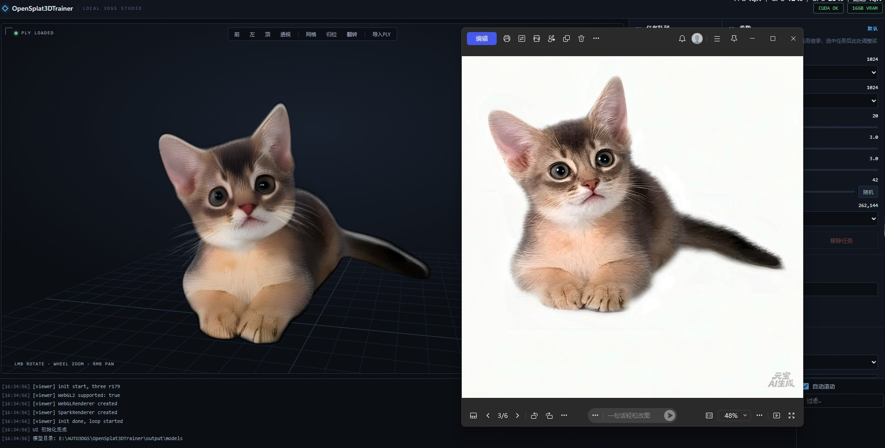

# OpenSplat3DTrainer

> Turn a single image into a 3D Gaussian Splatting (3DGS) model — fully local GPU inference, no Python runtime.

**中文版 README：[README-zh.md](README-zh.md)**

OpenSplat3DTrainer is a local 3DGS generation tool: feed it one image, and in tens of seconds it produces a 3D Gaussian Splatting model you can inspect, import, and export in the built-in 3D viewport.

The inference core is a **LibTorch C++** (TorchScript) reimplementation of the [TripoSplat](https://github.com/VAST-AI-Research/TripoSplat) image-to-3D method — no Python runtime. The frontend is a WebView2 desktop host serving a local HTTP app; the viewport uses the [Spark](https://github.com/antimatter15/spark) Gaussian Splatting renderer.

---

## Features

- **Single-image 3DGS generation** — one photo to a high-quality 3D gaussian model
- **Batch queue** — generate many images in a row, each task with its own parameters
- **Full parameter control** — sampling steps, guidance, shift, seed, gaussian count, input resolution, matting resolution
- **Adjustable input resolution** — 512 / 768 / 1024 / 1536, trade speed vs detail
- **Real-time 3D viewport** — Spark renderer with front / left / top / perspective views, grid, reset, flip, PLY import
- **Adjustable rendering** — tune smoothing and supersampling live in the "Render" panel
- **Dual VRAM modes** — resident (performance) vs on-demand (memory-saving)
- **Task progress bar** — live progress across matting / encoding / sampling steps / decoding
- **File logging** — `log.txt` records everything for easy debugging
- **Output formats** — PLY / SPLAT

---

## Rendering comparison



---

## Downloads

- **GitHub Releases** — grab the latest build (exe + runtime libraries + frontend) from the [Releases](../../releases) page;
- **China cloud drive** — mirror links are provided in each release description for faster access in mainland China;
- Model weights (`models/`, ~3 GB) ship with releases or have a separate download link in the release notes.

---

## Hardware requirements

| Item | Requirement |
| --- | --- |
| GPU | **NVIDIA** (CUDA 12+) |
| VRAM | **12 GB or more recommended** |
| Minimum | 8 GB (low-VRAM mode, on-demand model loading) |

- ≥ 10 GB free VRAM: use **High VRAM mode** (models resident, fastest).
- < 10 GB: use **Low VRAM mode** (models loaded/released per stage, lower peak).

> The UI still opens without an NVIDIA GPU, but generation is unavailable.

---

## Quick start

1. Put the six model weights into `models/` (exported from TripoSplat):
   `rmbg.pt`, `dinov3.pt`, `vae_encoder.pt`, `flow_model.pt`, `octree.pt`, `gs_decoder.pt`
2. Deploy `OpenSplat3DTrainer_Launcher.exe` and the DLLs from `output/` to the target machine
3. Launch:
   - First run: pick the VRAM mode (High / Low)
   - "Add images" or drag images straight into the window
   - Select a task to tune its parameters (or batch-generate with defaults)
   - Hit "Start", watch the progress bar
4. Double-click a finished task to view it in the 3D viewport, or import any PLY

---

## Inference pipeline

```
input image
   │  BiRefNet matting (adjustable resolution)
   ▼
feature encoding (DINOv3 + Flux2VAE)
   ▼
flow sampling (steps / guidance / shift) ── per-step progress
   ▼
octree + GS decode → gaussian attributes (pos / color / scale / rot)
   ▼
export PLY / SPLAT + viewport preview
```

---

## Building

- **Dependencies**: Visual Studio 2022+, CMake 3.20+, LibTorch (CUDA, via `CMAKE_PREFIX_PATH`)
- **WebView2 SDK**: not MIT-licensed, so it is not committed; `scripts/build.ps1` auto-runs `scripts/fetch_webview2.ps1` to pull it from NuGet when missing (or run it manually)
- **Core** (`app/`): inference engine + exporters (LibTorch C++)
- **Launcher** (`launcher/`): WebView2 desktop host + frontend (HTML/CSS/JS + Three.js + Spark)

```powershell
# example (point CMAKE_PREFIX_PATH at your torch install)
cmake -S launcher -B launcher/build -DCMAKE_BUILD_TYPE=Release -DCMAKE_PREFIX_PATH="<torch-path>"
cmake --build launcher/build --config Release
```

Build artifacts deploy to `output/` (exe + runtime DLLs + `web/` frontend + `models/`).

## Third-party components & licenses

| Component | License | How it ships |
| --- | --- | --- |
| [Spark](https://github.com/sparkjsdev/spark) | MIT | committed (`launcher/third_party/Spark`, `launcher/web/vendor/Spark`) |
| [three.js](https://threejs.org/) | MIT | committed (`launcher/web/vendor/three`) |
| [nlohmann/json](https://github.com/nlohmann/json) | MIT | committed (`launcher/third_party/nlohmann`) |
| WebView2 SDK | Microsoft permissive (not MIT) | not committed; fetched from NuGet by the build script |
| TripoSplat model weights | per TripoSplat upstream | not committed (`models/`); shipped with releases |

---

## Roadmap

- **Image generation models** — generate the input image from text / reference images, removing the input-photo dependency;
- **Multi-view consistency** — strengthen reconstruction quality with multi-angle generation;
- More export formats and rendering backends.

---

## Credits

- [Tripo / TripoSplat](https://github.com/VAST-AI-Research/TripoSplat) — generation method and model weights;
- [antimatter15 / Spark](https://github.com/antimatter15/spark) — real-time gaussian splatting renderer;
- [three.js](https://threejs.org/) — WebGL 3D foundation.

---

## Contributing

Contributions of any kind are welcome: bug fixes, feature requests, docs, UI polish.

- Open an issue with a description (attach `output/log.txt` if relevant);
- Fork and submit a pull request;
- C++ / CUDA core, frontend (HTML / JS / design), or rendering pipeline — pick your lane.

Before contributing, make sure your change at least: **builds**, **doesn't raise the VRAM peak**, and keeps the UI/logs in Chinese consistent.

---

## License

This project is open-sourced under the **MIT License** (see [LICENSE](LICENSE)).

Model weights and the generation method originate from [TripoSplat](https://github.com/VAST-AI-Research/TripoSplat); the renderer and frontend dependencies (Spark, three.js, etc.) follow their respective upstream licenses.
